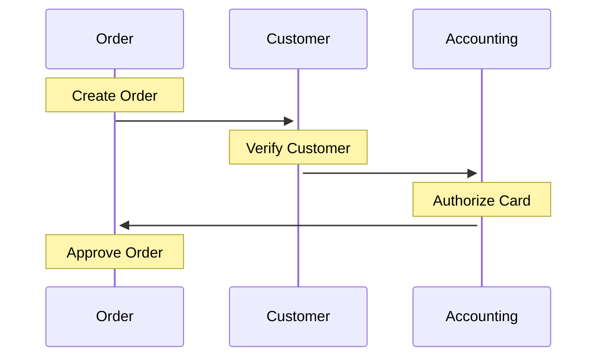
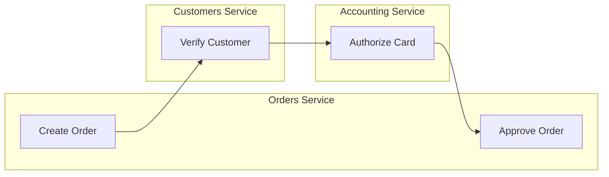
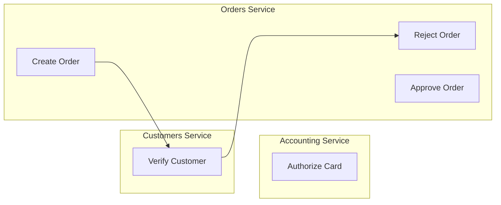
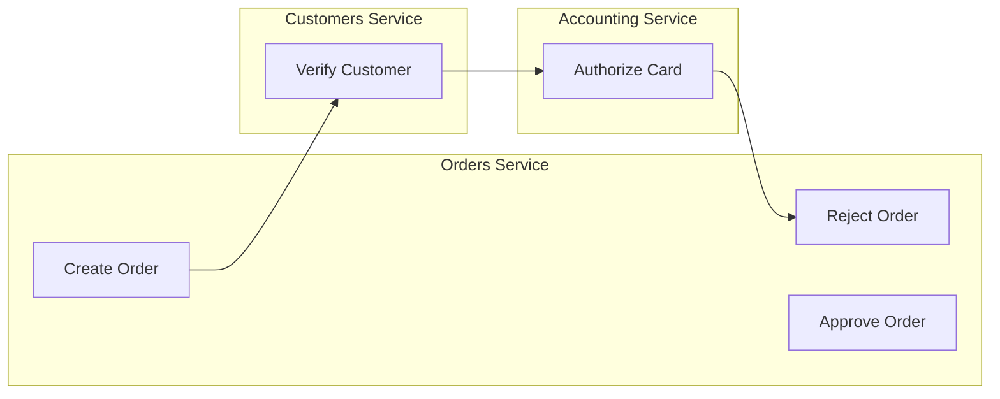
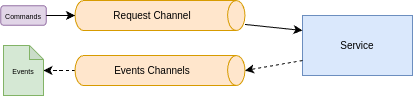
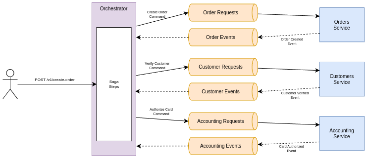

# Sagas Pattern with Golang

## What is a Transaction?
Transaction is the processing of a set of operations that are executed as a unit of work. Each transaction (all operations) must be successfully executed or fail as a single unit, cannot be partially completed. Maintaining the data in a consistency state.

### The ACID model
#### Atomicity
Guarantees that every operation within a transaction is executed as a unit of work, so either all operations are performed to success or none of them are applied.

#### Consistency
Guarantees that the operations executed within the transaction leave the data in a consistent state.

#### Isolation
Guarantees that concurrent transactions do not interfere with each other by isolating intermediary data state.

#### Durability
Guarantees that after a transaction completes (committed) the data is safely stored.

## Challenges
Working with transactions in a non-microservices environment reduces the complexity to maintain data consistency. However, when dealing with microservices where each one has access owns its data, it's really difficult to implement a transaction that spans across services. So here is where the *Saga Design Pattern* shines.

## Saga Pattern
Saga pattern is a pattern to keep data consistency in a microservices environment by implementing a workflow that contains a sequence of steps that are executed until completion. The saga pattern is not a distributed transaction mechanism, however it is a sequence of local transactions spanning across multiple services to complete a workflow.

### Steps
A step is process in a saga workflow that will execute some business logic and return a value by a async message broker or a HTTP response.

There are three types of steps while design a saga workflow.

#### Compensable Step
Are the ones that can be rolled back to a previous state. 
> It's important to keep in mind that a rollback does not necessarily means revert the operation. Ex:. The create order step creates an order in the database, however if we need to rollback this step, the approach is not to delete the create operation, but to change the status of the order to a rejected state.

#### Pivot Step
If committed the saga transaction **must** run util completion.
> In the create order saga, the pivot step is the card authorization step. If the pivot step succeeds all the steps ahead must be completed.

#### Retryable Step
Are the one that runs after the pivot step and are **guaranteed** to succeed.

****
## Project
The demo for the project is a simpler and shorter version of the saga example from the [Microsservices Patterns](https://www.manning.com/books/microservices-patterns) by *Chris Richardson* book.

### Steps

| Step | Service    | Type        | Name            | Operation       | Compensation |
| ---- | ---------- | ----------- | --------------- | --------------- | ------------ |
| 1    | Order      | Compensable | Create Order    | CREATE_ORDER    | REJECT_ORDER |
| 2    | Customer   | -           | Verify Customer | VERIFY_CUSTOMER | -            |
| 4    | Accounting | Pivot       | Authorize Card  | AUTHORIZE_CARD  | -            |
| 4    | Order      | Retryable   | Approve Order   | APPROVE_ORDER   | -            |

### Successful Flow

### Failures
#### Invalid Customer

#### Card not authorized

### Style Of Communication
For this orchestrated saga demo, each service will use two Kafka topics: one for command requests and another that will produce events as the outcome of a command.

The topic's naming pattern is defined as:
- For requests: `service.SERVICE_NAME.requests`
- For events: `service.SERVICE_NAME.events`

Examples:
- `service.orders.request`
- `service.orders.events`

### Architecture
The general architecture of this demo is as follow:

#### Orchestrator
A golang server that will receive http request with the contract.

### Type of Steps

# References
- https://microservices.io/patterns/data/saga.html
- https://www.databricks.com/br/glossary/acid-transactions
- https://www.techtarget.com/searchdatamanagement/definition/ACID
- https://en.wikipedia.org/wiki/Transaction_processing
- https://www.baeldung.com/cs/transactions-intro
